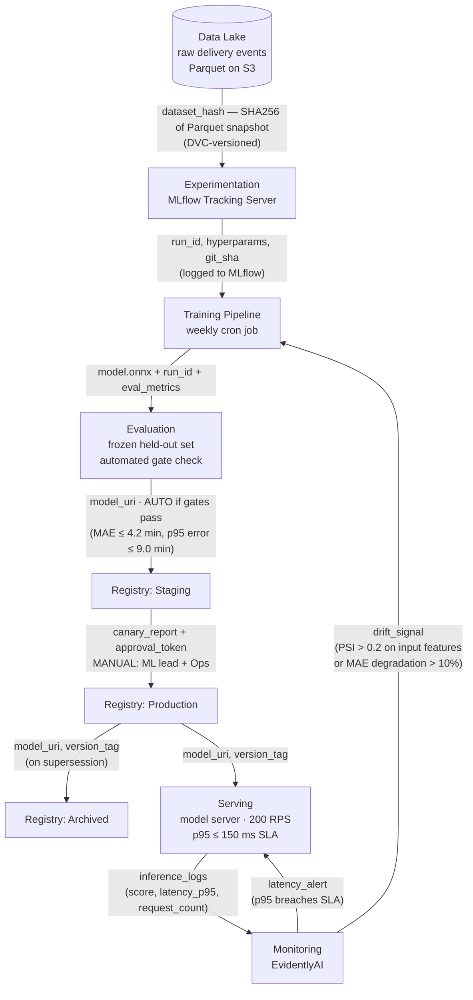

# ETA Model — MLOps Lifecycle

## Transition annotations

| Arrow | Automatic or Manual | Trigger |
|---|---|---|
| Evaluation → Staging | **Automatic** | All gates pass (MAE + p95 error thresholds on frozen eval set) |
| Staging → Production | **Manual** | ML lead + Ops approve after reviewing canary report |
| Production → Archived | **Automatic** | Triggered when a new model is promoted to Production |
| Monitoring → Training | **Automatic** | Drift signal emitted when PSI > 0.2 on any input feature or MAE degrades > 10% vs. baseline |
| Monitoring → Serving | **Automatic** | Latency alert if p95 breaches 150 ms SLA for > 5 min |
